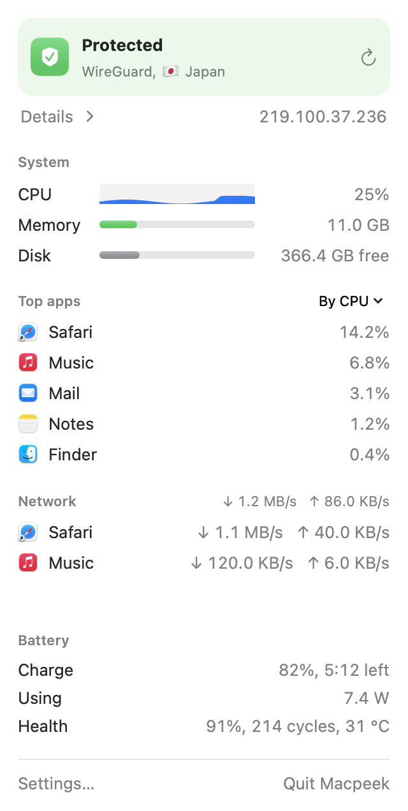

<p align="center">
  
</p>

<h1 align="center">macpeek</h1>

<p align="center">
  Your Mac at a glance, from the menu bar: VPN and privacy status, CPU, memory,<br>
  network, disk and battery. Small, quiet, and easy on energy.
</p>

<p align="center">
  <a href="https://github.com/tangheng05/macpeek/actions/workflows/ci.yml"></a>
  
  
</p>

<p align="center">
  <picture>
    <source media="(prefers-color-scheme: dark)" srcset="assets/menubar-dark.png">
    
  </picture>
</p>

<p align="center">
  <picture>
    <source media="(prefers-color-scheme: dark)" srcset="assets/popover-dark.png">
    
  </picture>
</p>

<sub>Screenshots are rendered by CI with sample data.</sub>

## Install

```sh
brew install --cask tangheng05/tap/macpeek
```

Or without Homebrew:

```sh
curl -fsSL https://raw.githubusercontent.com/tangheng05/macpeek/main/install.sh | sh
```

Macpeek needs macOS 26 or later. It isn't notarized yet; both methods clear the quarantine flag so it opens without the "Open Anyway" step.

## What it shows

**In the menu bar:** a CPU ring and a memory pressure level (how hard macOS is working to free up memory, not just how full RAM is), drawn in the same monochrome style as the system icons (or in colour, if you prefer). You can also add network speed and free and used disk space.

**Click it for more:**

- **Privacy.** Whether you're protected, with your VPN and country at a glance. Open Details for your public IP (click to copy), location, provider, and whether DNS and IPv6 go through the VPN. Run Full Test (⌘R) and Copy Report (⌘C).
- **System.** CPU, memory and disk, plus the top five apps by CPU, memory or energy. Helper processes are folded into their app, so Chrome counts as one. A heat warning appears only when your Mac is slowing down to cool.
- **Network.** Live download and upload speed, and which apps are using it.
- **Battery.** Charge, power draw in watts, health and cycle count.

**Open it from anywhere** with ⌃⌥⌘M (change it in Settings), and have it start at login.

**Notifications** (each one can be turned off): the VPN disconnects, your public IP changes while on VPN, memory runs out, or your Mac starts throttling from heat.

## Easy on energy

- Network and VPN changes, battery, memory pressure and heat are pushed by macOS. Macpeek doesn't poll for them.
- One timer reads the cheap system-wide counters every 2 seconds (configurable), with slack so macOS can batch its wake-ups.
- The per-app lists only run while the popover is open.
- The public IP check runs when your network changes, when you ask, or every 30 minutes while a VPN is on. Nothing else.
- Everything pauses while the display sleeps.

## Good to know

- The **DNS check** looks at whether your active DNS servers came from the VPN. It doesn't send test queries to an outside server.
- The public IP lookup uses [ipinfo.io](https://ipinfo.io), with [freeipapi.com](https://freeipapi.com) as a fallback. IPv6 is checked with [ipify](https://www.ipify.org).
- Apps running as another user (system daemons) don't show up in the top-app lists, because reading them needs admin rights.

## Command line

```sh
/Applications/Macpeek.app/Contents/Helpers/macpeek status --json
```

## Build from source

You need macOS 26 and Xcode 26.

```sh
make install   # builds, copies to /Applications and opens it
make test
make snapshots   # renders the UI to build/snapshots
make energy      # runs the app for a minute and checks CPU and memory
```

## Releasing

Bump `CFBundleShortVersionString` in `Resources/Info.plist`, commit, then run `scripts/publish.sh`. It pushes a `v<version>` tag, and the Release workflow tests, builds and publishes the GitHub release and updates the cask in [homebrew-tap](https://github.com/tangheng05/homebrew-tap). A tag with a suffix like `v0.2.0-rc1` makes a prerelease and leaves the cask alone.

The cask update needs a `TAP_TOKEN` repository secret: a fine-grained token with **Contents: read and write** on `homebrew-tap`.

## Roadmap

- [x] Project setup, CI on a macOS 26 runner
- [x] Phase 1: menu bar graph, UI snapshots, energy check and app icon in CI
- [x] Phase 2: popover with top apps
- [x] Phase 3: VPN detection, public IP, leak checks, alerts
- [x] Phase 4: network speed, disk, battery, thermal
- [x] Release workflow, launch at login, welcome window, global shortcut
- [ ] Phase 5: first release on Homebrew
- [ ] Later: real DNS leak test, Wi-Fi details, charge limit reminders, widgets

## License

MIT
